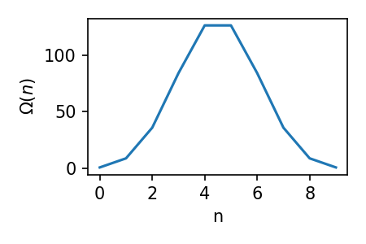

# Topics
* Thermal Equilibrium and the Zeroth Law of Thermodynamics
* Thermometers
* Micro-states versus macro-states
* Temperature
* Ensembles
## Thermal Equilibrium
What exactly is temperature? Qualitatively, it is how hot or cold an object is, but this is of course subjective. If we have two bodies, and we know that one with temperature $T_1$ is hotter than one with temperature $T_2$, then we know that $T_1>T_2$.

Furthermore, we know that if we bring two bodies into thermal contact with each other, heating (energy in transit) will occur between bodies (shown in b above), and they'll eventually end up with a temperature $T_1>T_{\rm f}>T_2$ (c). When this is achieved, and there is no net flow between the bodies, they are in **thermal equilibrium**.

This process is not reversible. That is, if we have two objects in thermal contact, and they are in thermal equilibrium, we would never expect them to spontaneously to undergo a flow of energy that goes from (c) back to (a). So, this means as a function of time, bodies tend towards thermal equilibrium.

Realising this, and also then that if multiple bodies are in thermal equilibrium with each other, then all bodies must be at the same temperature leads us to the Zeroth law of thermodynamics.

==**Zeroth Law of Thermodynamics**
Two systems, each separately in thermal equilibrium with a third, are in equilibrium with each other.==
## Application of the Zeroth Law: Thermometers
Imagine now we want to measure the temperature of an system. If we bring that system into thermal contact with a device whose thermal properties we know, and wait for them to reach thermal equilibrium, then we know the temperature of the first system. 

Such devices are called thermometers, and they come in various types:
* Liquid thermometers, where the corresponding change in volume of the liquid gives us a change in temperature.
* Electric thermometers, where the electrical resistance of the device changes with temperature.

The problem with these sorts of thermometers is that their properties (volume, resistance) only depend linearly on temperature within limit temperature ranges (at high temperatures, electrical thermometers melt while liquid thermometers boil for example). So they can't be used to give an absolute definition of temperature which is grounded in fundamental physics. To get this, we are going to need some statistical arguments, and to do this, we need to know the difference between microstates and macrostates.
## Microstates versus Macrostates
To understand these terms, let's look at a firm example grounded which borrows concepts from quantum mechanics and electromagnetism. Imagine we have some  dipoles in a magnetic field. Each dipole contributes an interaction energy of $- \mu \cdot B$. Quantum mechanics (this will come next semester, but it's always good to try and tie subjects together where possible) tells us that only specific orientations of the dipole in the magnetic field allowed. This is simplest when -the dipoles possess angular momentum of $\hbar/2$, which is referred to as "spin 1/2". You can also reframe this entire argument as flipping coins, and counting how many are heads and tails.

The dipoles can thus line up in one of two directions: parallel, or anti-parallel to the magnetic field. This leads to an interaction energy of $\mp \mu B$ per dipole. Imagine now we have $N$ dipoles. If $n$ are oriented parallel to the field, then $(N-n)$ must be anti-parallel. Thus, the total energy of the system is given by:

$$
    E(n) = n(-\mu B)+(N-n)(\mu B) = (N-2n)\mu B
$$

This means that if we have $N=9$, and $n=7$, we would have an interaction energy of $-6\mu B$. So why is this interesting?

Well, consider examples A and B below. The both have two dipoles which are oriented anti-parallel to the magnetic field, while the other 7 are all in alignment. From a microscopic point of view, the two scenarios are different, as the individual atoms which are anti-parallel are different in both cases. However, from a macroscopic point of view, the interaction energy of both with the magnetic field (which is what we can measure) are the same. These means that a **given macrostate can be described by a large number of equally likely of microstates**.

For the above example, there are $2^N$ microstates. The number of microstates which can give the same interaction energy $E(n)$ is
$$
    \Omega(n) = \frac{N!}{n!(N-n)!}
$$
This is referred to as the statistical weight. It's worth considering exactly what it means - see Section 1.4 of Blundell & Blundell for a more robust discussion of where this term comes from. For the moment, the below plot shows the statistical weight for our above toy problem, where we vary n.

What this shows us is that the statistical weight is highest for when $n$ is between 4 and 5. This should make sense as this is when half of the dipoles are oriented parallel to the B field, and half anti-parallel, and so we have the most freedom with placing them in the grid. This also means that the macrostate given by $n=4/5$ is the most probable state to occur, as these macrostates have the largest number of microstates.
## Temperature
We can now use the above expresssion for statistical weight to arrive at a defintion of the temperature of an object. First, let's consider 2 bodies which are in thermal contact.

For the following, we are going to assume that this is a closed system (that is, we're not losing any energy to the surroundings) and so, at all times, the total energy of the system is given by $E=E_1+E_2$. As such, all we need to do is specify $E_1$ and the macrostate of the system will be determined. 
The first system can be in any one of $\Omega_1(E_1)$ microstates and the second system can be in any one of $\Omega_2(E_2)$ microstates. Thus, the system as a whole can be in any number of $\Omega_1(E_1) \Omega_2(E_2)$ microstates.

Now, if we let the system reach thermal equilibrium, then the system will appear to be in the macrostate which maximises the number of microstates (consider the above graph to convince yourself of this). As such, the most probable division of energy between the two systems is the one which maximises $\Omega_1(E_1) \Omega_2(E_2)$. So we end up with
$$
\frac{{\rm d}}{{\rm d}E_1} \left(\Omega_1(E_1) \Omega_2(E_2)\right) = 0
$$
This gives
$$
\Omega_2(E_2) \frac{{\rm d} \Omega_1(E_1) }{{\rm d}E_1} + \Omega_1(E_1) \frac{{\rm d} \Omega_2(E_2) }{{\rm d}E_2} \frac{{\rm d} E_2 }{{\rm d}E_1} = 0
$$
Now recalling that $E=E_1+E_2$ and is fixed gives ${\rm d}E_1=-{\rm d}E_2$, which in turn gives $\frac{{\rm d}E_1}{{\rm d}E_2}=-1$. This simplifies our above expression to
$$
\frac{1}{\Omega_1} \frac{{\rm d} \Omega_1}{{\rm d} E_1} - \frac{1}{\Omega_2} \frac{{\rm d} \Omega_2}{{\rm d} E_2} = 0
$$
from which we get
$$
    \frac{{\rm d ln} \Omega_1}{{\rm d} E_1} = \frac{{\rm d ln} \Omega_2}{{\rm d} E_2}
$$
This condition defines the most likely division of energy between the objects which we would call "being at the same temperature". As such, we can now define
$$
    \frac{1}{k_{\rm B}T} = \frac{{\rm d ln} \Omega}{{\rm d} E}
$$
where the choice of $k_{\rm B}T$ will be motivated later.
## Ensembles
In order to make use of this definition for temperature, we are going to use an ensemble. To understand their use, imagine we want to measure the properties of a system. Because systems are constantly jumping between microstates, it can be hard for us to perfectly measure these properties. As such, we will imagine many copies of the same system, each of which we measure the intended property of, and then our measurement is just the average of all of these (which removes the small fluctuations due to the systems bouncing between microstates). Such "photocopies" are called ensembles. There are three main types of ensembles we shall encounter in our studies:

* **The microcanonical ensemble**: an ensemble of systems that all have the same fixed energy.
* **The canonical ensemble**: an ensemble of systems, each of which can exchange energy freely with a large reservoir of energy.
* **The grand canonical ensemble**: an ensemble of systems, each of which can exchange energy and particles freely with a large reservoir.