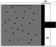

# Topics
* The First Law.
* Heat Capacity.
    - Of an Ideal Gas.
* Reversibility.
* Isothermal/Adiabatic Expansions.
# The First Law of Thermodynamics
At the end of the last lecture, we stated the first law. In mathematical form, this is:
$$ 
    {\rm d U} = {\rm d}Q + {\rm d}W.
$$
Our first task is to see if there's an easy form for expressing how the ${\rm d}W$ term behaves. To do this, consider the below setup.

The force used on the piston to compress the gas is $F=P A$, where $A$ is the area of the piston. By compressing the gas such that it's change in volume is $-{\rm d}V$, we also get that $A{\rm d}x=-{\rm d}V$. Thus, the work done in compressing the gas is given by
$$
    {\rm d}W = F {\rm d} x = -P {\rm d} V
$$
This assumes that the process is reversible, but we'll come back to that later on. So, the first law can also be written as
$$ 
    {\rm d U} = {\rm d}Q -P {\rm d} V
$$
for reversible processes.

## Revisiting Heat Capacity
So what does the first law allow us to evaluate? Let's return to our definition of heat capacity from lecture 1, which stated that
$$
    {\rm d}Q = C {\rm d T}  \Rightarrow C = \frac{{\rm d}Q}{{\rm d}T}
$$
We now want to use this expression in combination with the first law to see how adding heat changes the internal energy of a gas.

To do this, let's start with the internal energy of gas, and say that this is only a function of temperature and volume such that $U=U(T,V)$. A small change in the internal energy can thus be written as
$$
    {\rm d} U = \left(\frac{\partial U}{\partial T}\right)_V {\rm d} T + \left(\frac{\partial U}{\partial V}\right)_T {\rm d} V
$$
which is a mathematical operation we can do as $U$ is a function of state (i.e. ${\rm d} U$ is an exact differential). Rearranging the first law such that it's in relation to ${\rm d} Q$ gives
$$
    {\rm d} Q = {\rm d}U +P {\rm d} V = \left(\frac{\partial U}{\partial T}\right)_V {\rm d} T + \left[ \left(\frac{\partial U}{\partial V}\right)_T +P \right] {\rm d} V.
$$
Now, taking the derivative of this with respect to ${\rm d} T$ gives
$$
    \frac{{\rm d} Q}{{\rm d} T} = \left(\frac{\partial U}{\partial T}\right)_V + \left[ \left(\frac{\partial U}{\partial V}\right)_T +P \right] \frac{{\rm d} V}{{\rm d}T}
$$
So the heat capacity at constant volume then becomes
$$
    C_V = \left(\frac{{\rm d} Q}{{\rm d} T}\right)_V = \left(\frac{\partial U}{\partial T}\right)_V.
$$
The heat capacity at constant pressure is then
$$
    C_P = \left(\frac{{\rm d} Q}{{\rm d} T}\right)_P = \left(\frac{\partial U}{\partial T}\right)_V + \left[ \left(\frac{\partial U}{\partial V}\right)_T +P \right] \left( \frac{{\rm d} V}{{\rm d}T}\right)_P
$$
A natural question to then ask is - which is larger? That is, does it require more energy to increase the temperature of a sample when performed at constant pressure, or at constant volume?

The combined expression is:
$$
    C_P-C_V = \left[ \left(\frac{\partial U}{\partial V}\right)_T +P \right] \left( \frac{{\rm d} V}{{\rm d}T}\right)_P.
$$

Finally, the ratio of these two heat capacities is called the Adiabatic Index, and is given by
$$
    \gamma = \frac{C_P}{C_V}.
$$
This quantity is a useful quantity, so it's worth memorising its definition.
## The Heat Capacity of an Ideal Gas
Given that the internal energy of an ideal gas is given by $U=\frac{3}{2} N k_{\rm B} T$, let's derive expressions for $C_P$ and $C_V$.
First, note that the internal energy is independant of volume. As such 
$$
    \frac{\partial U}{\partial V}=0.
$$
For one mole of ideal gas, we know that $P V = N k_{\rm B} T$, so
$$
    V = \frac{N k_{\rm B} T}{P}
$$
which gives
$$
    \left(\frac{\partial V}{\partial T}\right)_P = \frac{N k_{\rm B}}{P}
$$
So then the heat capacities are
$$
\begin{align}
C_V &= \left(\frac{\partial U}{\partial T}\right)_V = \frac{3}{2}N k_{\rm B}\\
C_P-C_V &= \left[ \left(\frac{\partial U}{\partial V}\right)_T +P \right] \left( \frac{{\partial} V}{{\partial}T}\right)_P = N k_{\rm B}\\
C_P &= \frac{5}{2}N k_{\rm B}
\end{align}
$$
## Reversibility, Isothermal Expansions, and Adiabatic expansions
In most scenarios, a physical process involves heat being dissipated away into the surrounding environment. This means that such a process is very difficult to naturally reverse as it is very unlikely that the lost energy will flow back into the system. A nice example of this is to consider an egg falling off a table. It will hit the floor and shatter, losing some energy into the ground in the process. 

A more formal way of thinking about this is that, for large numbers, the statistical behaviour of them make some outcomes more likely than order (recall the graph of the statistical weight looked). As such, this suggests that when dealing with large numbers, physical changes appear to be driven in an irreversible direction.

Our challenge now is to come up with a way of carrying out a process reversibly (and was the challenge faced by physicists when attempting to construct the most efficient engine possible). So, how do we do this? Consider expanding or compressing a gas. If we do it very, very slowly, then the gas will remain in thermodynamic equilibrium throughout the process. Such a process is referred to as **quasistatic**. This means that for any small change to the system, the system immediately reaches a new thermodynamic equilibrium (it's functions of states all have well behaved values). In practice this never happens, but it's a useful imaginary concept for us to figure out how things should work in an idealised world.

There are two such processes which we consider below.
## Isothermal expansion of an Ideal Gas
Consider a reversible, isothermal expansion of an ideal gas. Isothermal here means "at constant temperature", such that ${\rm \Delta}T=0$. We want to know what the heat change of such a gas is. As a starting point, let's consider the internal energy of the gas:
$$
    {\rm d} U = C_ V {\rm d}T = 0.
$$
This means that, from the first law,
$$
    {\rm d} Q = -{\rm d}W
$$
So, the work done by the gas as it expands is equal to the heat it absorbs from its surroundings. Recalling from earlier that ${\rm d}W=-P {\rm d}V$ for a reversible process, we can then obtain the total heat absorbed by the gas:
$$
\begin{align}
{\rm \Delta} Q &= \int {\rm d} Q\\
&= -\int {\rm d} W\\
&= \int^{V_2}_{V_1} P{\rm d} V\\
&= \int^{V_2}_{V_1} \frac{N k_{\rm B} T}{V}{\rm d} V\\
&= N k_{\rm B} T \ln \frac{V_2}{V_1}\\
&= R T \ln \frac{V_2}{V_1}
\end{align}
$$
where that last expression is for one mole of ideal gas.

So, for an expansion $V_2>V_1$, so ${\rm \Delta} Q > 0$
## Adiabatic expansion of an Ideal Gas
Consider a reversible, adiathermal expansion of an ideal gas. Adiathermal here means "without flow of heat". A process which is both adiathermal and reversible is **adiabatic**. For this process
$$
    {\rm d} Q = 0.
$$
This means that, from the first law,
$$
    {\rm d} U = {\rm d}W
$$
For an ideal gas, we have that ${\rm d} U = C_V {\rm d T}$, and because the process is reversible we again have that ${\rm d}W=-P {\rm d}V$. As such, we have that
$$
\begin{align}
C_V {\rm d T} &= -P {\rm d}V \\
&= - \frac{Nk_{\rm B}}{V} {\rm d}V
\end{align}
$$
Let's work with one mole of ideal gas for the moment ($N_{\rm A} k_{\rm B}=R$). As such, we get
$$
\ln \frac{T_2}{T_1} = -\frac{R}{C_V} \ln \frac{V_2}{V_1}.
$$
Recalling that $C_P=C_V+R$ we find that
$$
    \gamma = \frac{C_P}{C_V}=1+\frac{R}{C_V}
$$
which gives
$$
    -\frac{R}{C_V} = 1-\gamma.
$$
This let's us simplify the above expression to get
$$
    \ln \frac{T_2}{T_1} = (1-\gamma) \ln \frac{V_2}{V_1} = \ln \left(\frac{V_2}{V_1}\right)^{1-\gamma}
$$
Finally, we get that
$$
    TV^{\gamma-1} = const
$$
Using the ideal gas law ($P V \propto T$) let's us rewrites this as both
$$
\begin{align}
P^{1-\gamma} T^{\gamma} &= const\\
P V^{\gamma} &= const
\end{align}
$$
## Isotherms & Adiabats
So now we have two scenarios for working an ideal gas. It can undergo an adiabatic process, in which case $P V^\gamma = const$, or it can undergo an isothermal expansion, in which case $PV=const$. We'll cover what these processes can be used for later, but the below can be treated as a prelude, as it plots pressure versus volume for both processes for two different initial conditions.
