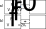

* Entropy changes within closed systems.
* Entropy an the 1st law.
* Entropy from a statistical point of view.
# Entropy Example
Imagine we have a large reservoir at temperature $T_R$ which is placed into thermal contact with a small system at temperature $T_S$. They both end up at the temperature of the reservoir, $T_R$. The heat transferred from the reservoir to the system is given by
$$
    \Delta Q = C(T_S-T_R)
$$
where C is the heat capacity of the system. There are two different outcomes here:

1. $T_S$>$T_R$. This means that heat would be transferred from the system to the reservoir. As such, the entropy of the system would decrease as it gets colder and the entropy of the reservoir would increase as it warms up.
2. $T_S$<$T_R$. This means that heat would be transferred from the reservoir to the system. As such, the entropy of the reservoir would decrease as it gets colder and the entropy of the system would increase as it warms up.

Let's explicitly calculate the entropy change of both the system and reservoir:
$$
\begin{align}
    \Delta S_{\rm reservoir} &= \int \frac{{\rm d} Q}{T}\\
                             &= \frac{1}{T_R} \int {\rm d} Q\\
                             &= \frac{\Delta Q}{T_R}\\
                             &= \frac{C(T_S-T_R)}{T_R}\\
\end{align}
$$
The entropy of the system is given by
$$
\begin{align}
    \Delta S_{\rm system} &= \int \frac{{\rm d} Q}{T}\\
                             &= \int ^{T_R} _{T_S} \frac{C {\rm d} T}{T}\\
                             &= C \ln \frac{T_R}{T_S}
\end{align}
$$
So the entropy of the system is allowed to increase or decrease, as is that of the reservoir. But the entropy of the Universe, which is given by
$$
\begin{align}
    \Delta S_{\rm Universe} &= \Delta S_{\rm reservoir}+\Delta S_{\rm system}\\
                            &=\frac{C(T_S-T_R)}{T_R}+C \ln \frac{T_R}{T_S}\\
                            &=C\left[\frac{T_S}{T_R} +\ln \frac{T_R}{T_S} - 1 \right]
\end{align}
$$
The below figure plots this expression and shows that even though the entropy of the system and reservoir may increase or decrease individually, their combined change is always positive!

# Revisiting the first law
Ok, armed with this definition of entropy, let's consider again the first law of thermodynamics, which states that
$$
    {\rm d} U = {\rm d} Q + {\rm d} W
$$
For a reversible change, we now have that
$$
    {\rm d} Q = T {\rm d} S
$$
by rearranging Clausius' law. We also know that 
$$
    {\rm d} W = -P {\rm d} V
$$
This means that 
$$
    {\rm d} U = T{\rm d} S - P {\rm d} V
$$
We have derived this assuming everything is reversible. However, all of the quantities in the previous equation are functions of state - that is, they are path independant. This means that this equation also holds for irreversible changes. This might not seem immediately obvious. As a quick check, remember that for irreversible changes we have that
$$
    {\rm d} Q \leq T {\rm d} S
$$
while
$$
    {\rm d} W \geq - P {\rm d} V.
$$
So for irreversible changes, ${\rm d} Q $ decreases while ${\rm d} W $ increases, meaning ${\rm d} U$ is balanced. As such 
$$
    {\rm d} U = T{\rm d} S - P {\rm d} V
$$
is true **for any process**!
Now, using one of the tricks we used earlier, given that U is now only a function of S and V, we can write U as
$$
    {\rm d} U = \left( \frac{\partial U}{\partial S}\right)_V {\rm d} S + \left( \frac{\partial U}{\partial V}\right)_S {\rm d} V
$$
let's us identify pressure and temperature as
$$
\begin{align}
    T &= \left( \frac{\partial U}{\partial S}\right)_V\\
    P &= -\left( \frac{\partial U}{\partial V}\right)_S\\
\end{align}
$$
## Summary
Thus, the important equations for us are

1. ${\rm d} U = {\rm d} Q + {\rm d} W$, which is always true.
2. ${\rm d} Q = T{\rm d} S$, which is true for reversible changes.
3. ${\rm d} W = -P{\rm d} V$, which is true for reversible changes.
4. ${\rm d} U = T{\rm d} S-P{\rm d} V$, which is always true.

For irreversible changes,  ${\rm d} Q \leq T{\rm d} S$ and ${\rm d} W \geq -P{\rm d} V$.
# A statistical basis for entropy - The Joule Expansion
Consider the following isolated system. Imagine we have a 2 containers, each of volume $V_0$, and which are initially isolated from each other by a valve. In the left container, we have an ideal gas with initial pressure $P_i$, and in the right, we have a vacuum. The ideal gas is described by the equation of state $P_i V_0 = N k_{\rm B} T_i$.

We then open the valve, and the gas rapidly expands to fill both containers. At this stage, the gas will fill a volume of $2V_0$ and have a temperature and pressure of $T_f$ and $P_f$ respectively. It's equation of state is thus $P_f 2V_0 = N k_{\rm B} T_f$.

Since the entire system is thermally isolated, we have that $\Delta U = 0$. Recalling from earlier that the internal energy, U, of an ideal gas only depends on temperature, this then means that $\Delta T = 0$, and so $T_i=T_f$. As such, we get
$$
\begin{align}
    P_i V_0 &= N k_{\rm B} T_i =  P_f 2 V_0\\
    P_f &= \frac{P_i}{2}
\end{align}
$$
However, calculating the entropy associated with this change is difficult. Immediately after opening the valve, the gas will expand rapidly, meaning it is not in equilibrium and will not be undergoing a reversible process. However, entropy is a function of state. This means that the difference in entropy between the gas prior to the valve opening and after opening the valve and letting the gas reach equilibrium after expanding irreversibly **is the same** as if we had reversible expanded the gas, as the change in entropy is path independent.

As such, we can pretend that the gas were expanded, say, isothermally, calculate the change in the entropy for this expansion, and it will be the same as for the irreversible process. this gives
$$
\begin{align}
    \Delta S &= \int ^{f}_{i} {\rm d} S \\
             &= \int ^{V_f}_{V_i} \frac{P}{T}{\rm d} V \\
             &= \frac{1}{T}\int ^{2V_0}_{V_0} P{\rm d} V \\
             &= \frac{1}{T}\int ^{2V_0}_{V_0} \frac{Nk_{\rm B}T}{V}{\rm d} V \\
             &= Nk_{\rm B}\int ^{2V_0}_{V_0} \frac{1}{V}{\rm d} V \\
             &= Nk_{\rm B} \ln 2\\
\end{align}
$$
The first law of thermodynamics can be written as
$$
    {\rm d} U = T {\rm d}S - P{\rm d} V
$$
and is always true. From this, in the last lecture we arrived at the following definition for temperature
$$
    T = \left(\frac{\partial S}{\partial U}\right)_V
$$
Several lectures ago, we also definied temperature in terms of the statistical weight of a system in a given macrostate to be
$$
    \frac{1}{k_{\rm B} T} = \frac{{\rm d} \ln \Omega}{{\rm d} E}.
$$
Comparing these, we can then identify another definition of $S$ as
$$
    S = k_{\rm B} \ln \Omega.
$$
At this point, it's important to note that this definition assumes that the system is in a macrostate with a fixed energy (this comes from the section entitled "Temperature" back in Lecture 2). We'll generalise the result later.