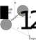

# Equipartition of Energy
Before going further, we are going to discuss the equipartition theorem. To motivate our discussion, let's write down what the kinetic energy of a particle of mass m and moving a velocity v is
$$
    E_K = \frac{1}{2} mv^2.
$$
Now, if we have a particle at the end of a spring, the potential energy of that particle when displaced by a distance x is
$$
    E_P = \frac{1}{2} kx^2
$$
The total energy of a particle at the end of the spring is thus
$$
    E = E_K + E_P = \frac{1}{2} mv^2 + \frac{1}{2} kx^2
$$
As the particle oscillates back and forth, the energy within the system is constantly moving between kinetic energy and potential energy, while the total energy of the system remains constant. The interesting thing to note here is that both energy terms in this equation have a quadratic dependence on some variable ($v^2$ for kinetic, $x^2$ for potential). 

Now let's imagine we have some system which is connected to a heat bath. The system is capable of extracting energy from the heat bath or transferring energy to it. What is the mean thermal energy of the system? The thermal energy must be stored as either kinetic energy or potential energy - how exactly is it distributed?

So, let's assume we can write the energy down as some quadratic function - that is, we could write
$$
    E = \alpha x^2
$$
where $\alpha$ is some constant and x is some variable. The probability that the system would have a particular energy $\alpha x^2$ would then be
$$
    P(x) = \frac{{\rm e}^{-\beta \alpha x^2}} {\int_{-\infty}^{+\infty}{\rm e}^{-\beta \alpha x^2} {\rm d} {x}} 
$$
where the bottom term is an integral rather than the normal summation we see in Z because we're going to assume here that $x$ can have non-integer values.
The mean energy of the system is then
$$
\begin{align}
    <E> &= \int_{- \infty}^{+\infty} E P(x) {\rm d} x \\
    <E> &= \frac{\int_{-\infty}^{+\infty} \alpha x^2 {\rm e}^{-\beta \alpha x^2} {\rm d} x} {\int_{-\infty}^{+\infty}{\rm e}^{-\beta \alpha x^2} {\rm d} {x}} \\
    <E> &=\frac{1}{2\beta}\\
    <E> &=\frac{1}{2} k_{\rm B} T
\end{align}
$$
This is a pretty significant result, as even though we've assumed an arbitrary function for the energy, the mean energy that we get out just depends on temperature! It is possible (but non-trivial) to extend this result to allow for the energy to be made up of multiple quadratics, say
$$
    E = \sum_{i=1}^{n} \alpha_i x_i^2
$$
then the result becomes
$$
    <E> =\frac{n}{2} k_{\rm B} T
$$
This is a very, very useful theorem. Each quadratic term that contributes to the total energy is called a mode, or degree of freedom of the system. Thus, we get the theorem for the equipartition of energy:

**If the energy in a classical system is the sum of n quadratic modes, and the system is in contact with a heat reservoir at temperature $T$, the mean energy of the system is given by $nk_{\rm b} T/ 2$**
## Applications
**Translational motion in a monatomic gas**: Imagine we have a particle which is able to move in all 3 directions. It has a velocity component associated with each direction, and as such, a kinetic energy associated with each direction. This gives
$$
    E = \frac{1}{2} mv_x^2+\frac{1}{2} mv_y^2+\frac{1}{2} mv_z^2
$$
Summation of 3 quadratic modes, meaning the mean energy of the system
$$
    <E> = \frac{3}{2} k_{\rm B} T
$$

**Rotational motion in a diatomic gas**: Imagine we have 2 particles bonded together with a rigid bond, such that the diatomic particle can then spin about 2 axes. This gives an additional 2 terms due to rotation about each axis which doesn't have a neat symmetry, giving
$$
    \frac{L_1^2}{2I_1} + \frac{L_2^2}{2I_2}
$$
This means the energy is
$$
    E = \frac{1}{2} mv_x^2+\frac{1}{2} mv_y^2+\frac{1}{2} mv_z^2+\frac{L_1^2}{2I_1} + \frac{L_2^2}{2I_2}
$$
and thus
$$
    <E> = \frac{5}{2} k_{\rm B} T
$$

**Vibrational energy in a diatomic gas**: Now imagine that same gas, but where the bond is no longer rigid, but instead acts like a spring with spring constant k. This adds gives another 2 terms:
$$
    \frac{1}{2}\mu ({\bf \dot{r_1}-\dot{r_2}})^2 + \frac{1}{2} k (|{\bf \dot{r_1}-\dot{r_2}}|-l_0)^2
$$
where k is an imagined spring constant, $l_0$ is the equilibrium molecular bond length, and $\mu$ is the reduced mass of the system. This means the total energy is 
$$
    E = \frac{1}{2} mv_x^2+\frac{1}{2} mv_y^2+\frac{1}{2} mv_z^2+\frac{L_1^2}{2I_1} + \frac{L_2^2}{2I_2}+\frac{1}{2}\mu ({\bf \dot{r_1}-\dot{r_2}})^2 + \frac{1}{2} k (|{\bf \dot{r_1}-\dot{r_2}}|-l_0)^2
$$
and thus
$$
    <E> = \frac{7}{2} k_{\rm B} T
$$

## Dulong-Petite rule
A relatively good model for a solid is that we have a rigid lattice of atoms, with each atom attached to it's nearest neighbour by a chemical bond that allows vibrations like. If there are $N$ atoms in the solid, then we have approimately 3$N$ atoms. Each spring has two quadratic modes of energy (1 kinetic and 1 potential), which means each spring contributes $k_{\rm B} T$ to the mean energy. As such, the total mean energy of the solid should be $3N k_{\rm B} T$, and has a heat capacity of $3 N k_{\rm B}$. This is known as the Dulong-Petit rule, and is something we'll come back to in future lectures.

# Revisiting the partition function
In this lecture, we are going to revisit the partition function which we discussed during the introductory part of the course, and figure out how it relates to the thermodynamic quantities which we introduced in classical thermal physics.

The partition function is defined as 
$$
    Z = \sum_i {\rm e}^{-\beta E_i}
$$
It looks pretty boring, but is a very powerful tool, as we'll shortly see. Typically, when solving a statistical mechanics issues, there are two steps.

1. Write down the partition function.
2. Follow the standard procedures needed to get the relevant quantity out of the partition function.

For this lecture, we are going to be focusing on the single particle partition function - that is, we will work out what $Z$ is for a single particle. We'll generalise to many particles later.

## 1. Writing done the partition function
This is not too difficult a step, and is something you have encountered in your problem sets previously. Let's take a look at some explicit examples.

### The two level system
Let the energy of a system be $\pm\epsilon/2$. The partition function for such a system is thus
$$
    Z = {\rm e}^{\beta \epsilon /2}+{\rm e}^{-\beta \epsilon /2} = 2 \cosh \left(\frac{\beta \epsilon}{2}\right)
$$

### The simple harmonic oscillator
Let the energy of a system be $(n+1/2)\hbar \omega$, where $\hbar=h/(2\pi)$ and n can go up to infinity. The partition function for such a system is thus
$$
    Z = \sum_{n=0}^{\infty} {\rm e}^{\beta (n+1/2)\hbar \omega} = {\rm e}^{-\beta \hbar \omega/2} \sum_{n=0}^{\infty} {\rm e}^{-\beta n \hbar \omega}=\frac{{\rm e}^{-\beta \hbar \omega/2}}{1-{\rm e}^{-\beta \hbar \omega}}
$$
where we've used the result for an infinite geometric progression of
$$
    a\sum_{n=0}^{\infty} r^n = \frac{a}{1-r}
$$
where $a$ is a constant to simplify the expression.

## 2. Deriving useful quantities from the partition function
Ok, now that we can write down what the partition function, let's see what we can derive from it.

### The internal energy (U)
As discussed in previous lectures, the internal energy of a system is given by
$$
    U = \sum_i P_i E_i
$$
$$
    U = \frac{\sum_i E_i {\rm e}^{-\beta E_i}}{\sum_i {\rm e}^{-\beta E_i}}
$$
Given that $Z = \sum_i {\rm e}^{-\beta E_i}$, then $\frac{{\rm d} Z}{{\rm d} \beta} = - \sum_i E_i {\rm e}^{-\beta E_i}$. This leaves us with
$$
    U = -\frac{1}{Z}\frac{{\rm d} Z}{{\rm d} \beta} = -\frac{{\rm d} \ln Z}{{\rm d} \beta}
$$
as we've seen previously. It can also sometimes be useful to rewrite this in terms of temperature. Using
$$
    \beta = \frac{1}{k_{\rm B}T} \to \frac{{\rm d} \beta}{{\rm d} T} = -\frac{1}{k_{\rm B}T^2}
$$
gives
$$
    U = k_{\rm B}T^2 \frac{{\rm d} \ln Z}{{\rm d} T}
$$

### Heat Capacities
Recalling that
$$
    C_{\rm V} = \left(\frac{\partial U}{\partial T}\right)_V
$$
we get
$$
    C_{\rm V} = 2 k_{\rm B}T \frac{{\rm d} \ln Z}{{\rm d} T} + k_{\rm B}T^2 \frac{{\rm d^2} \ln Z}{{\rm d} T^2}
$$

### Entropy (S)
The probability of a state being in some energy j is given by
$$
    P(E_j) = \frac{{\rm e}^{-\beta E_j}}{Z}
$$
Taking the log gives
$$
    \ln P(E_j) = -\beta E_j - \ln (Z)
$$
If we now recall our statistical definition of entropy, which was
$$
    S = -k_{\rm B} \sum_i P_i \ln P_i
$$
(see Lecture 7) then we get
$$
    S = k_{\rm B} \sum_i P_i [\beta E_i + \ln (Z)]= k_{\rm B} \beta \sum_i P_i E_i + \ln (Z)\sum_i P_i
$$
We can now substitute $U = \sum_i P_i E_i$ and $\sum_i P_i E_i = 1.0$ to get
$$
    S = k_{\rm B} [\beta U + \ln(Z)]
$$
which in terms of temperature works out as
$$
    S =  \frac{U}{T} + k_{\rm B} \ln(Z)
$$

### The Helmholtz Free Energy (F)
The Helmholtz Free Energy is given by
$$
    F = U-TS
$$
Using the above substitution for $S$ then leads to
$$
    F = -k_{\rm B} T \ln(Z)
$$
or, in terms of Z is
$$
    Z = {\rm e}^{-\beta F}
$$
The Helmholtz Free Energy turns out to be very useful in deriving pretty much everything else we've defined over the last 4 weeks. For example, we can get the entropy by recalling that
$$
    S = -\left(\frac{\partial F}{\partial T}\right)_V
$$
(again, Lecture 7) which gives
$$
    S = k_{\rm B} \ln(Z) + k_{\rm B} T \left(\frac{\partial \ln(Z)}{\partial T}\right)_V
$$
which is the same as the above expression if we use the relation between $U$ and $\frac{{\rm d} \ln Z}{{\rm d} T}$ derived earlier.