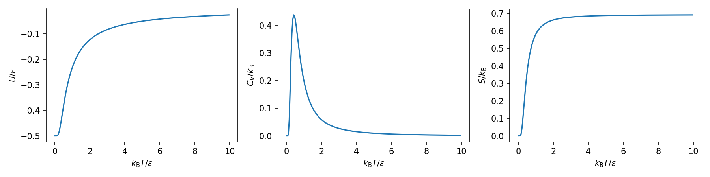
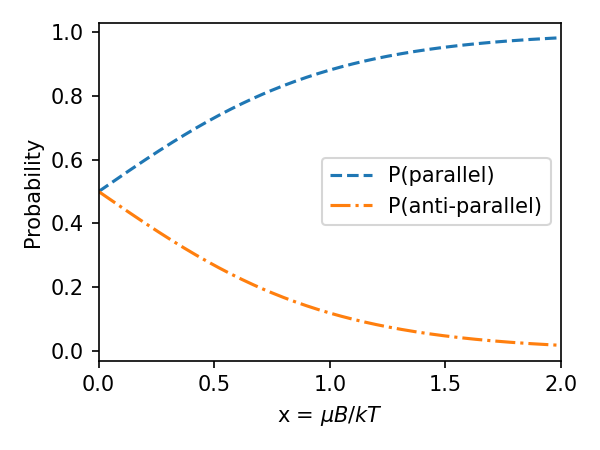
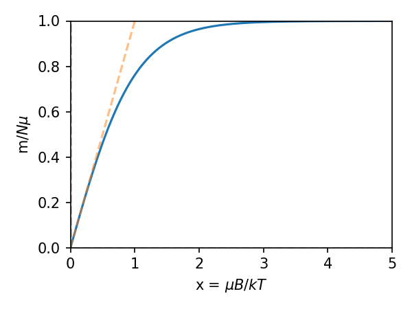

In the last lecture, we were looking at what quantities we can derive from the partition function. Let's very quickly wrap up that discussion.
### Pressure
From Lecture 7 we have that
$$
    P = -\left(\frac{\partial F}{\partial V}\right)_T = k_{\rm B} T \left( \frac{\partial \ln(Z)} {\partial V} \right)_T
$$

### Enthalpy
This lets us write down the enthalpy as
$$
    H = U+PV =  k_{\rm B}T^2 \frac{{\rm d} \ln Z}{{\rm d} T}+k_{\rm B} T V \left( \frac{\partial \ln(Z)} {\partial V} \right)_T
$$

### Gibbs Free Energy
$$
    G = F+PV =  -k_{\rm B} T \ln(Z) +k_{\rm B} T V \left( \frac{\partial \ln(Z)} {\partial V} \right)_T
$$
# Example
Let's take the 2 level system which was described earlier. This system has a partition function of
$$
    Z = 2 \cosh \left(\frac{\beta \epsilon}{2}\right)
$$
The internal energy of the system is
$$
    U = -\frac{{\rm d} \ln Z}{{\rm d} \beta}= -\frac{\epsilon}{2} \tanh\left(\frac{\beta \epsilon}{2}\right)
$$
The heat capacity of the system is given by
$$
    C_{\rm V} = \left(\frac{\partial U}{\partial T}\right)_V = k_{\rm B} \left(\frac{\beta \epsilon}{2}\right)^2 {\rm sech}^2\left(\frac{\beta \epsilon}{2}\right)
$$
The Helholtz Free energy is
$$
    F = -k_{\rm B}T \ln Z = -k_{\rm B}T \ln\left[2 \cosh \left(\frac{\beta \epsilon}{2}\right)\right]
$$
and so the entropy is
$$
    S = \frac{U-F}{T} = -\frac{\epsilon}{2T} \tanh\left(\frac{\beta \epsilon}{2}\right) + k_{\rm B} \ln\left[2 \cosh \left(\frac{\beta \epsilon}{2}\right)\right]
$$
Let's now look at what each of these functions are doing.

These plots are very instructive. Let's consider 2 distinct temperature regimes and see what the plots tell us:
### $T \to 0$
As the temperature drops to 0, the internal energy converges to $-\epsilon/2$. That is, the system settles into the ground state. The heat capacity and the entropy converge to 0, as they should in accordance with the third law.
### $T \to \infty$
As the temperature goes to $\infty$, the internal energy converges to $0$. This is because at these high temperatures, the probabilities that either state is populated are both 0.5, and the internal energy is $U=\sum_i P_i E_i=-0.5 \frac{\epsilon}{2}+0.5\frac{\epsilon}{2}=0$. The heat capacity goes to 0. This can be understood by considering the fact that adding any energy to the system as this stage does not affect which state the system is likely to be in.

The heat capacity does have a maximum - that is, there is a temperature at which adding more energy substantially changes the probability of the internal energy changing.

This example demonstrates the big picture behind statistical mechanics. You write down $Z$, derive the relevant quantities, and then examine how those quantities behave for various temperatures. However, writing $Z$ down isn't always easy - there are only a handful of systems that we are explicitly able to solve for the discrete energy levels.
## Combining Partition Functions
Let's now consider a system where the energy has various **independent** contributions, where the contributions are distinguishable. For example, imagine the energy is given by
$$
    E_{i,j} = E_i^{(a)}+E_j^{(b)}
$$
The partition function for such a combination would be
$$
    Z = \sum_i\sum_j {\rm e}^{-\beta (E_i^{(a)}+E_j^{(b)})} = \sum_i{\rm e}^{-\beta E_i^{(a)}}\sum_j {\rm e}^{-\beta E_j^{(b)}}=Z_a Z_b
$$
so in this case, the partition functions of the independent contributions multiply. It is simple to generalise this to N **independent** contributions, in which case we get
$$
    Z = \prod_{i=1} ^N Z_i
$$
# Paramagnetism
Up until now, we've been assuming that the work term, ${\rm d}W$, in the 1st Law could be replaced by $-P{\rm d}V$. This expression represents work done on compressing/expanding a gas. However, we can very easily replace the work with the appropriate expression for a different system, and then use the same tricks we've used prior to get a handle on the thermodynamics of the system. Let's look at an example of that today.

Recall from lecture 2 that the magnetic dipole moment is given by $-{\bf \mu} \cdot {\bf B}$. Now, imagine we have a lattice of dipoles, and that the dipoles do not interact with each other. If we then apply a magnetic field to this lattice, the dipoles will line up and either contribute $-\mu B$ or $\mu B$ to the energy of the system. This effect, where a magnetic field applied to the a system causes the magnetic moments to line up, is called **paramagnetism**.

First, let's figure out what classical thermodynamic quantities we need to address this problem. Recall that the first law of thermodynamics is
$$
    U = Q+W
$$
The work on dipole to line it up is given by $-{\bf m} \cdot {\rm d} {\bf B}$. This is analogous to the work done compressing a gas. As such, we can write an equivalent of the first law of thermodynamics as
$$
    {\rm d} U = T {\rm d} S - m {\rm d} B
$$
The magnetic moment is $m=MV$, where M is the magnetisation and V is the volume. We are now going to define the magnetic susceptibility to be
$$
    \chi = \lim_{H \to 0}\frac{M}{H}
$$
where $H$ is the magnetic field strength (and is related to the magnetic flux density, B, through $B=\mu_0(H+M)$). For paramagnets, $\chi << 1$ which implies that $M<<H$, meaning we can approximate it as
$$
\chi \approx \frac{\mu_0 M}{B}
$$
Our new definition of the first law also implies that we can write an equivalent of the Helmholtz function
$$
    F = U - TS
$$
such that
$$
    {\rm d} F = -S {\rm d} T - m {\rm d} B
$$

Now, let's consider a single dipole in our system, and write down the partition function:
$$
    Z_1 = \sum_i {\rm e}^{- \beta E_i}= {\rm e}^{-\beta \mu B} + {\rm e}^{\beta \mu B} = 2 \cosh (\beta \mu B)
$$

This means the probability of having a dipole contribute an interaction energy of $\mp\mu B$ looks like the below graph

So what does this graph tell us? Over on the left $x<<1$. This means that the magnetic field is weak, and the temperature is high. Under such conditions, each dipole has a 50/50 chance of being parallel or anti-parallel. Over on the far right, we have $x>>1$, which means the magnetic field is strong and the temperature is small. Under these conditions, the dipoles all end up parallel.

Looking at this picture, and thinking about it for a while, should convince you that in this situation we are balancing internal energy versus entropy - when we have a low temperature and high magnetic field, then we are maximising the internal energy. When we have a low magnetic field and a high temperature, we are maximising the entropy of the system. As such, we can use the Helmholtz function for this problem.

We've already found that the partition function for N particles which are not interacting and which are distinguishable, the partition function is then given by
$$
    Z = Z_1^N.
$$
The internal energy of the system is given by
$$
   U = -\frac{{\rm d} \ln Z}{{\rm d} \beta}= -N \mu B \tanh\left(\mu \beta B\right)
$$
The Helmholtz function is then given by
$$
    F = -k_{\rm B} T \ln (Z_N) = -N k_{\rm B} T \ln [2 \cosh (\beta \mu B)]
$$
Also, given that the Helmholtz function
$$
    {\rm d} F = -S {\rm d} T - m {\rm d} B
$$
leads to
$$
    m = -\left(\frac{\partial F}{\partial B}\right)_T = N \mu \tanh (\beta \mu B)
$$

Returning to the magnetisation, we wrote this quantity down earlier as
$$
    M = \frac{m}{V} = \frac{N \mu}{V} \tanh (\beta \mu B)
$$
If we focus on the weak field regime (where the dependence between $m$ and $\tanh$ is basically linear, orange line above), then we have that
$$
    M = \frac{N \mu^2 B}{V k_{\rm B} T}
$$
This combined with the expression above for susceptability gives us that
$$
    \chi = \frac{N \mu^2 \mu_0}{V k_{\rm B} T}
$$
This shows that the magnetic susceptability of a paramagnet is inversely proportional to its temperature. This is known as Curie's law, and also means that since
$$
    \chi \propto \frac{1}{T}
$$
then this means that 
$$
    \left( \frac{\partial \chi}{\partial T} \right)_B < 0
$$
We'll need this in a second.

So, what does this let us accomplish? Well, let's consider the Helmholtz Free Energy again. It leads to the equiavelent Maxwell relation of
$$
    \left(\frac{\partial S}{\partial B}\right)_T = \left(\frac{\partial m}{\partial T}\right)_B \approx \frac{V B}{\mu_0} \left( \frac{\partial \chi}{\partial T} \right)_B
$$
where that last simplification comes from taking 
$$
\chi \approx \frac{\mu_0 M}{B}
$$
and replacing $M$ with $m/V$, and carrying out the derivative (that is, it only works for paramagnets).

Thus, the change in heat during an isothermal change in the B field is
$$
    \Delta Q = T \left( \frac{\partial S}{\partial B} \right)_T \Delta B = \frac{T V B}{\mu_0} \left( \frac{\partial \chi}{\partial T} \right)_B \Delta B<0
$$
This means that heat is emitted from the material during this process.

We can use our usual trick of dealing with differentials
$$
    \left(\frac{\partial T}{\partial B}\right)_S \left(\frac{\partial B}{\partial S}\right)_T \left(\frac{\partial S}{\partial T}\right)_B = -1
$$
to obtain an expression for change in temprature due to an adiabatic change in the B field
$$
    \left(\frac{\partial T}{\partial B}\right)_S = - \left(\frac{\partial S}{\partial B}\right)_T \left(\frac{\partial T}{\partial S}\right)_B.
$$
If we define the heat capacity at constant magnetic field to be $C_{B} = T \left(\frac{\partial S}{\partial T}\right)_B$ then we get
$$
    \left(\frac{\partial T}{\partial B}\right)_S = - \frac{T V B}{\mu_0 C_B} \left(\frac{\partial \chi}{\partial T}\right)_B
$$ 
where has to be $>0$. This means that we can cool down the paramagnet by adiabatically reducing the magnetic field on the sample. This is an incredibly useful result, as experimentally it allows for cooling of systems to millikelin (for electronic systems) and microkelvin (nuclear systems).

Such a cooling proceeds in the following manner.

1. A paramagnetic system is coupled to a heat bath, which is typically liquid helium at 4.2 K.
2. Isothermal magnetisation of the sample proceeds. Since in this process $\Delta Q < 0$ for positive increases in the B field, the paramagnet transfers heat into the liquid helium heat bath.
3. The system is decouple from the heat bath.
4. The system is adiabatically demagntised. Since $\left(\frac{\partial T}{\partial B}\right)_S$ is positive, this means reducing the B field reduces the temperature. This leads to a significant cooling of the system.