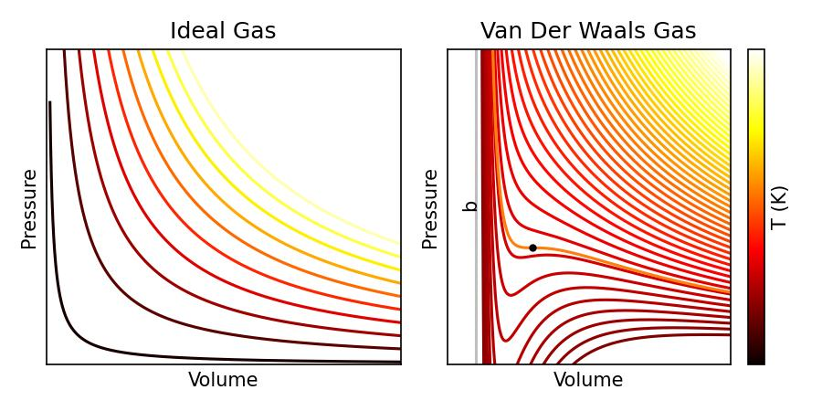

# Real Gases
So, we know of particular cases when gases do not behave like an ideal gas For example as they cool, their heat capacities diverge from the constant that the ideal gas law predicts. So let's look at a few ways in which we can improve on an ideal gas. 

Consider again the equation of state of an ideal gas:
$$
P V = Nk_{\rm B}T
$$
This equation leads to isotherms as plotted in the left of the below figure. To try and make this equation match the observed behaviour of real gases, we can think of two simple modifications:

1. Allow for non-zero molecule size. In essence, this means that molecules are no longer free to travel anywhere within the gas - instead, the volume they can probe is reduced slightly by the volume taken up by other molecules. We can simply parameterise this as $V\to V-N b$, where b is somehow related to the molecule size.
2. Allow for molecular attraction. If the density of the gas is given by $N/V$, then the change in energy related to $\frac{aN^2}{V^2} {\rm d}V$. This effectively increases the pressure we should see in the gas relative to the ideal pressure by $P=P_{\rm ideal} +\frac{a N^2}{V^2}$

These modifications then give Van Der Waal's equation of state
$$
    \left(P + \frac{a N^2}{V^2}\right) (V-N b) = N k_{\rm B} T
$$
This equation leads to isotherms as plotted on the right of the below figure.

#### Aside
This same equation can be arrived at in a more formal manner by considering the following. If we let the partition function for our gas be
$$
    Z_N = \frac{1}{N!}\left(\frac{V-Nb}{\lambda _{\rm th}^3}\right)^N e^{- \beta (- a N^2/V)}
$$
where again we've reduced the volume to account for the volume taken up by other molecules, and included an additional energy term in the partition function related to the interaction energy $-a N^2/V$. We can then calculate the Helmholtz free energy using $F=-k_{\rm B}T \ln (Z_N)$ and then $P=-\left(\frac{\partial F}{\partial V} \right)_T$ to get the above equation of state.

The Van der Waals equation of state behaves like the Ideal gas at high temperatures (the yellow curves to the top right of the plot). However, at low temperatures, the isotherms begin to exhibit a kink. To figure out what this represents, recall that the iso-thermal compressability of a gas is defined as
$$
    \kappa_{T} = -\frac{1}{V}\left(\frac{\partial V}{\partial P}\right)_T
$$
For an ideal gas, this is always positive (as the last term is always negative, as the isoterms always have a negative slope). However, as we can see from the plot of the Van der Waals equation of state, at low temperatures, there are regions where $\left(\frac{\partial V}{\partial P}\right)_T$ is positive, meaning $\kappa_{T}$ becomes negative. Under such conditions, increases the pressure exerted on the gas causes the volume to increase rather than decrease. Given that this means work is done on the gas ($W=-P{\rm d} V$), then energy is provided to further increase the pressure - meaning this configuration is highly unstable!

There is a critical temperature whose isotherm does not have a positive gradient, but which has an inflection point - this is the critical temperature, which we'll discuss in a few lectures time.

Let's now determine the location of this critical point for a Van der Waal's gas. Solving the Van der Waal's equation for $P$, and assuming we're working with 1 mole, gives:
$$
    P = \frac{N k_{\rm B}T}{V-Nb} - \frac{aN^2}{V^2}
$$
The inflection point occurs when
$$
    \left(\frac{\partial P}{\partial V}\right)_T = - \frac{N k_{\rm B} T}{(V-Nb)^2}+ \frac{2aN^2}{V^3}=0
$$
and
$$
    \left(\frac{\partial ^2 P}{\partial V^2}\right)_T = \frac{2N k_{\rm B} T}{(V-N b)^3}- \frac{6aN^2}{V^4}=0
$$
Solving this both for $N k_{\rm B} T$ gives
$$
     \frac{2aN^2(V-Nb)^2}{V^3} = N k_{\rm B} T = \frac{6aN^2(V-Nb)^3}{2V^4}
$$
which gives
$$
    2 = \frac{3(V-Nb)}{V}
$$
and thus the critical volume is
$$
    V_{\rm C} = 3Nb.
$$