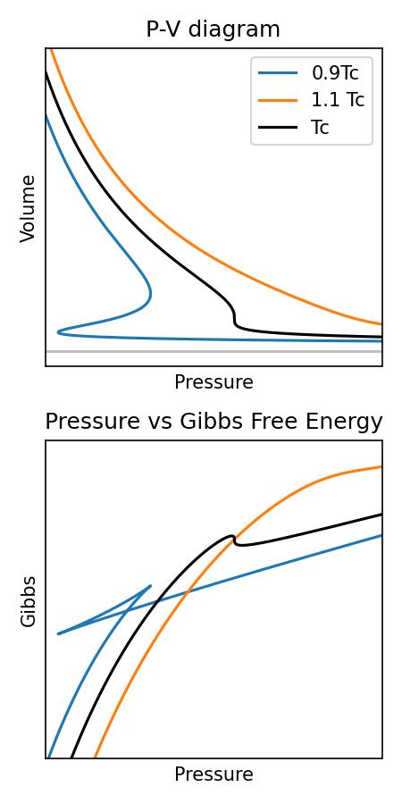
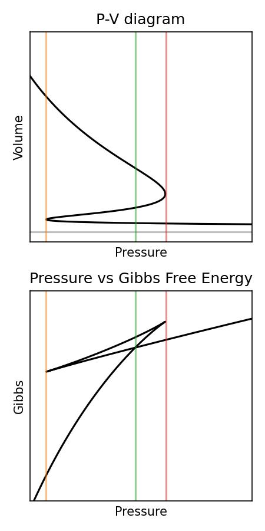

In the previous lecture, we derived the critical volume for a Van Der Waals gas:
$$
    V_{\rm C} = 3Nb
$$
Using this volume and the above equations then gives
$$
    T_{\rm C} = \frac{8a}{27 k_{\rm B} b}
$$
and
$$
    P_{\rm C} = \frac{a}{27 b^2}
$$
So what happens at the critical point? Well, let's look at the isothermal compressability:
$$
    \kappa_{T} = -\frac{1}{V}\left(\frac{\partial V}{\partial P}\right)_{T_c}
$$
We have that 
$$
\left(\frac{\partial P}{\partial V}\right)_{T_c} =0
$$
and so the isothermal compressability diverges!

So, in order to figure out what happens below the critical temperature, let's look at the Gibbs' Free energy. We're choosing this as the Gibb's function is useful for experiments which are carried out under constant temperature and constant pressure.

To get the Gibb's function, we'll first calculate the Helmholtz function for the VdW gas, which is given by
$$
P = -\left( \frac{\partial F}{\partial V} \right)_T
$$
Solving for $F$ this, and substituting $P$ from earlier, gives
$$
\begin{align}
F &= + f(T) - \left( \int\frac{N k_{\rm B}T}{V-Nb} - \frac{aN^2}{V^2} {\rm d} V \right)\\
F &= f(T) - N k_{\rm B}\ln({V-Nb}) - \frac{aN^2}{V} \\
\end{align}
$$
where $f(T)$ is some function of temperature that we don't really care about. This is because the Gibb's free energy is given by
$$
G = F+PV = f(T) -N k_{\rm B}\ln({V-Nb}) - \frac{aN^2}{V}+PV
$$
The Volume and Gibb's functions for a VdW gas are shown below versus $P$ for three different temperatures (one above the critical temperature, one at the critical temperature, and one below).

What you can see is that when the temperature of the system is above the critical temperature, both the volume and Gibbs functions are well behaved. However, below the critical temperature, bot the volume and pressure become multi-valued for certain pressures. Let's focus on just the temperature below the critical temperature for a moment.

Imagine we have a system which starts at high pressure and low volume (to the right of the red line). As the pressure is reduced in the system, you will stay on the line of lowest Gibbs energy. Eventually, your system reaches the pressure denoted by the green line. At this point, there are 2 volumes both with the exact same Gibbs energy - one on the bottom branch of the V-P diagram, and one on the top.

So what does this translate to? It means your system can be in 2 states (a low volume or high volume) state at the same time. Physically, this would mean if you had a system which started as a liquid, then at this point, your system can exist both as a liquid and a gas as the gibbs energy for both phases is the same!

The upper triangle of the Gibbs-Pressure diagram is an interesting phase space. Normally, it's very hard to get a system in there as they are states with higher Gibbs energies, but it is possible. We won't discuss these states in this course, but perhaps you will in future courses.