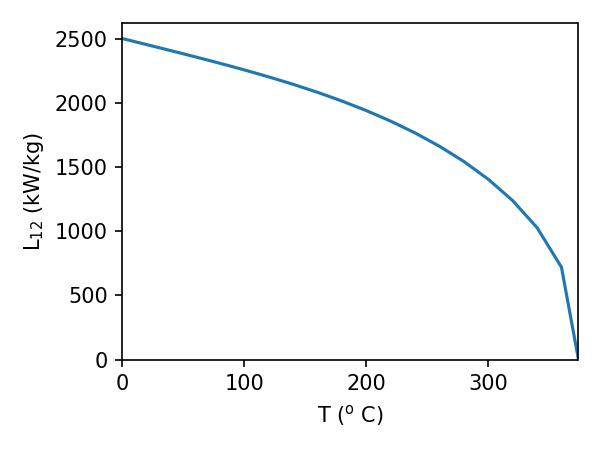

### Approximating the vapour pressure curve
When dealing with the vapour pressure curve (that is, liquid and vapour in equilibrium with each other), the following approximate treatment can be used. First, we shall assume that the volume of the substance in the vapour phase is much larger than in the liquid phase (a quick look at the numbers for water should convince you this is true, where the difference is 3 orders of magnitude). As such
$$
    \Delta V = V_2-V_1 \approx V_2
$$
Second, let's assume that when in a vapour form, the substance behaves like an ideal gas. As such, for one mole
$$
    P V_2 = R T
$$
This further gives that
$$
    \frac{{\rm d} P}{{\rm d} T} = \frac{L_{1,2}}{T \Delta V} \approx \frac{L_{1,2}}{T V_2} = \frac{P L_{1,2}}{R T^2}
$$
Assuming we are interested in water, then at waters usual boiling point at atmospheric pressure, we get
$$
    \frac{{\rm d} P}{{\rm d} T} = 3.56 \times 10^3 \: {\rm N} \: {\rm m^{-2}} \: {\rm K^{-1}}
$$
which is pretty close to what we got using actual values for the measured volume in the previous section (which tells us that vapour isn't a million miles away from behaving like an ideal gas!). 

This approxmiation also has another use. If the latent heat is assumed to be temperature independant, then we can integrate the above expression to get
$$
\begin{align}
    \frac{1}{P} {\rm d} P &= \frac{L_{1,2}}{R T^2} {\rm d} T\\
    \int \frac{1}{P} {\rm d} P &= \int \frac{L_{1,2}}{R T^2} {\rm d} T\\
    \ln (P) + {\rm const} &= -\frac{1}{2}\frac{L_{1,2}}{R T}\\
    P &= {\rm const} . \exp\left({-\frac{L_{1,2}}{2 R T}}\right)\\
\end{align}
$$
Note that in the above, we've worked this out for 1 mole. If you want to do different masses, you just need to add the term
$$
    P = {\rm const} . \exp\left({-\frac{M L_{1,2}}{2 R T}}\right)
$$
where M is the gram-molecular weight. Gram-molecular weight is an easy thing to compute. Hydrogen has a gram-molecular weight of 1 (that is, 1 mole weighs 1 gram). Water has a gram molecular weight of 18 (that is, 18 grams per mole) as each molecule has 2 hydrogen and one oxygen atom, and oxygen has a gram-molecular weight of 16.

# The critical point
It turns out the vapour pressure curve is a bit more interesting than we've previously drawn it. Consider the below figure, which shows how the latent heat of vapourisation for water changes with respect to temperature (showing that our above assumption that the latent heat is temperature independant is not always appropriate!). The data is from Engineering ToolBox, (2010). Water - Heat of Vaporization vs. Temperature. [online] Available at: https://www.engineeringtoolbox.com/water-properties-d_1573.html [Accessed 10/11/22]. I've saved the data as a .csv file with this notebook, in units of degrees Celsius and kW/kg respectively. 

This shows that at 373.946$^{\rm o}$ C, the latent heat of vapourisation goes to 0! This is known as the critical temperature, and it means that when we draw the pressure vapour curve in a P-T diagram, it stops at the critical point. To really understand what's going on here, we need to move beyond the ideal gas (for the moment!).

# Cooling gases
## The Joule effect (revisited)
In our final discussion around how real gases differ from an ideal gas, we are going to return to the Joule expansions which was introduced in Lecture 6. In this expansion, a gas which is initially on the left side of a container is suddenly allowed to expand into the right. If the system is entirely isolated, then no work is done on the gas, and it cannot exchange heat with its surroundings. As such, the internal energy of the gas remains constant.

In this scenario, we are interested in answering the following question: after opening the valve, does the temperature of the gas change, does it cool, or does it warm up? To answer this, we will need to evaluate the Joule coefficient, which we define as
$$
    \mu_{\rm J} = \left( \frac{\partial T}{\partial V} \right)_U
$$
It's been a while since we've used this trick, so it's worth recalling that
$$
    \left( \frac{\partial T}{\partial V} \right)_U \left( \frac{\partial V}{\partial U} \right)_T \left( \frac{\partial U}{\partial T} \right)_V = -1
$$
such that 
$$
    \left( \frac{\partial T}{\partial V} \right)_U = - \left( \frac{\partial U}{\partial V} \right)_T \left( \frac{\partial T}{\partial U} \right)_V
$$
so the Joule coefficient can be written as
$$
    \mu_J = - \left( \frac{\partial T}{\partial U} \right)_V \left( \frac{\partial U}{\partial V} \right)_T  = - \frac{1}{C_{\rm V}} \left( \frac{\partial U}{\partial V} \right)_T
$$
That last term is still a bit tricky to work with, so let's work to restructure this equation into something easier. First, from the fundamental thermodynamic relation we have that
$$
    {\rm d} U = T {\rm d} S - P {\rm d} V
$$
which implies that
$$
    \left(\frac{\partial U}{\partial V} \right)_T = T \left(\frac{\partial S}{\partial V} \right)_T - P
$$
Recalling the Maxwell relation
$$
  \left(\frac{\partial S}{\partial V} \right)_T =   \left(\frac{\partial P}{\partial T} \right)_V
$$
we get
$$
    \left(\frac{\partial U}{\partial V} \right)_T = T \left(\frac{\partial P}{\partial T} \right)_V - P.
$$
This finally gives the expression
$$
    \mu_{\rm J} = - \frac{1}{C_{\rm V}} \left[ T \left(\frac{\partial P}{\partial T} \right)_V - P \right]
$$
For an ideal gas, $PV = N k_{\rm B} T$. As such, 
$$
    \left(\frac{\partial P}{\partial T} \right)_V = \frac{N k_{\rm B}}{V}
$$
and
$$
    T \left(\frac{\partial P}{\partial T} \right)_V = P
$$
This means the Joule coefficient is 0 for an ideal gas, which means the temperature of the ideal gas does not change during the expansion.

However, as we now know, an ideal gas isn't always the appropriate equation of state to adopt for this situation. Let's instead assume we have a Van der Waals gas:
$$
    \left(P + \frac{aN^2}{V^2}\right) (V - Nb) = N k_{\rm B} T
$$
where $a$ is related to interatomic spacing and $b$ is due to the non-zero volume occupied by molecules in our gas. In this case
$$
    \left(\frac{\partial P}{\partial T} \right)_V  = \frac{N k_{\rm B}}{(V - Nb)}
$$
which means the Joule coefficient is
$$
    \mu_{\rm J} = - \frac{aN^2}{C_{\rm V}V^2}
$$
This is negative since $a$, $C_{\rm V}$, and $V^2$ are all positive, which means that
$$
    \left( \frac{\partial T}{\partial V} \right)_U < 0.
$$
That is, a real gas cools as it expands during a Joule expansion. This means that if we had a gas and wanted to cool it, we could use the Joule effect to do it without doing any work on the gas.

However, the setup is not really useful in real world situations (how often do you have a gas totally isolated to one side of a chamber, and then let it expand? Also, what would you even do with it afterwards?).