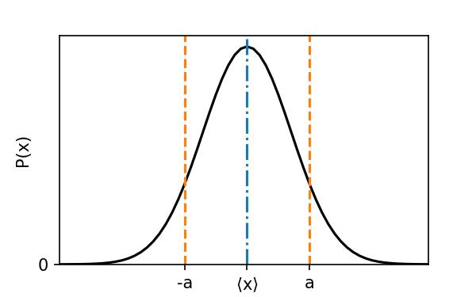

There are normally two types of variables we are interested in - discrete and continuous variables.
- Discrete: For example, the number of particles within a box - it must be a whole, real number, and is finite.
- Continuous: For example, length or time.
## Discrete probability distributions
Let x be some discrete random variable - that is, it can only take a finite number of values. We'll denote these values as $x_{i}$, and their probability of occurring will be $P_{i}$. First, we will require that
$$
\sum _i P_i = 1.
$$
The mean value of our variable is thus
$$
\left< x \right>=\sum_i x_i P_i.
$$
We can also define
$$
\left< x^2 \right> = \sum_i x_i^2P_i.
$$
## Continuous probability distributions
Let x be some continuous random variable - that is, it can only take a finite number of values. In this case, individual values of $x$ do not have a well defined probability, so instead we talk about probability intervals, saying that $P(x){\rm d}(x)$ is the probability of having a value between $x$ and $x+{\rm d}x$. Thus, we now require
$$
\int P(x) {\rm d}x =1.
$$
The mean and mean squared are then defined as 
$$
\begin{align}
\left< x \right> &=\int x P(x) {\rm d} x.\\
\left< x^2 \right> &=\int x^2 P(x) {\rm d} x.\\
\end{align}
$$
A very common example of a continuous probability distribution is the Gaussian, which has the general form
$$
P(x) = C {\rm e}^{-\frac{x^2}{2 a^2}}.
$$
This distribution has a maximum at $x=0$.Both $C$ and $a$ can be evaluated using the above requirements, and give
$$
C = \frac{1}{\sqrt{2 \pi a^2}}
$$

and
$$
a^2 = \left< x^2 \right>.
$$
An example of a Gaussian is plotted below - and note that a more general form of the Gaussian is
$$
P(x) = \frac{1}{\sqrt{2\pi a^2}} {\rm e}^{-\frac{(x-\left< x \right>)^2}{2a^2}}.
$$

# Variance
So imagine we now have some set of values. We know how to calculate the average (whether they're continuous or discrete) - the next useful piece of information is the spread of values. Let's define the deviation as
$$
x-\left< x \right>
$$
which tells us how far or below the average a given value lies. However, the average of this value for a distribution, $\left< x-\left< x\right> \right>$ should be 0! (Think about this to convince yourself it's true). So, instead, we use a quantity called the variance, $\sigma$, which is
$$
\begin{align}
\sigma^2&=\left< (x- \left< x \right> )^2 \right>\\
\sigma^2&=\left< x^2 \right>- \left< x \right>^2\\
\end{align}
$$

Now think about the Gaussian again - using the above definition, we can rewrite the general expression as 
$$
P(x) = \frac{1}{\sqrt{2\pi \sigma^2}} {\rm e}^{-\frac{(x-\left<x\right>)^2}{2\sigma^2}}.
$$
Now we can better understand the meaning of some of the terms - the variance is the standard deviation of a Gaussian distribution. Thus, when physicists discuss 1$\sigma$, 2$\sigma$, 3$\sigma$, it means we're taking about the probability of a result and how far from the central value of a Gaussian distribution the result lies.
# Binomial distribution
Let's now look at a very specific case of a discrete probability distribution: the binomial distribution. We'll start by considering a Bernoulli Trial, which is an experiment where we can only have 2 outcomes: success or fail. A good example would be tossing a coin, and labelling heads as a success, and tails as a fail. Or (relating this to PS 1), if a particle can be described as being on the left side of a room (success) or right side (fail).

The important thing is we will say the probability of a success occurring is $p$, meaning the probability of a failure is $1-p$.

Let's start by saying our variable is $x$, which can take a value of 1 for success and 0 for a failure. Using our above definitions, we can write down
$$
\begin{aligned}
\left<x\right> &= 0 \times (1-p) + 1 \times p = p\\
\left<x^2\right> &= 0^2 \times (1-p) + 1^2 \times p = p\\
\sigma &= \sqrt{\left<x^2\right>-\left<x\right>^2} = \sqrt{p-p^2}= \sqrt{p(1-p)}\\
\end{aligned}
$$

The binomial distribution, $P(n,k)$, is the probability of having $k$ successes from $n$ independent trails. First, the probability that we have $k$ successes and $n-k$ failures is $p^k (1-p)^{n-k}$. The number of ways we can arrange our $k$ successes (remembering our discussion of marbles in the first lecture) is the statistical weight, giving us
$$
P(n,k)=\Omega \: p^k (1-p)^{n-k}.
$$
This is the binomial distribution.